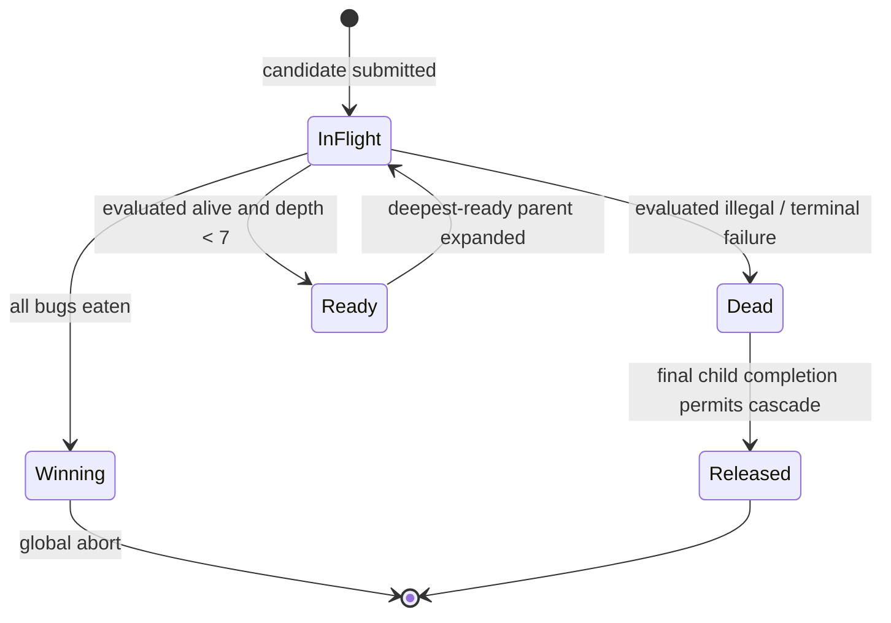
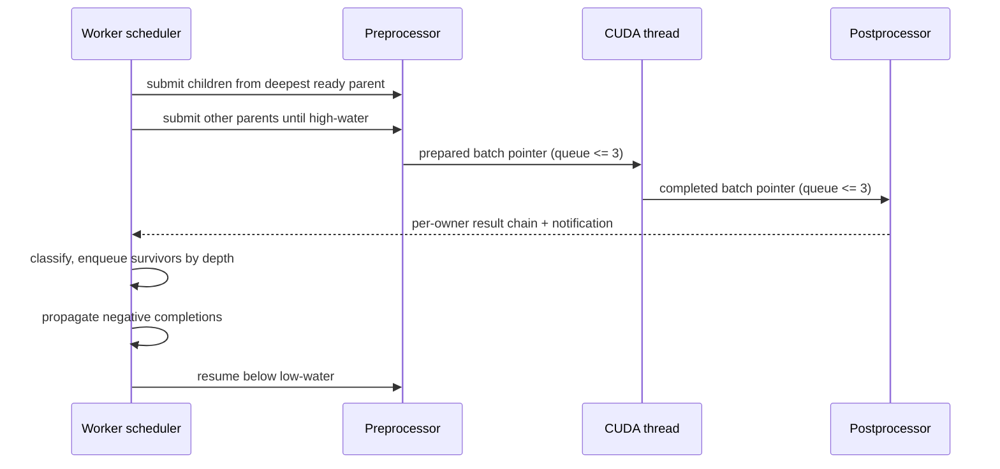
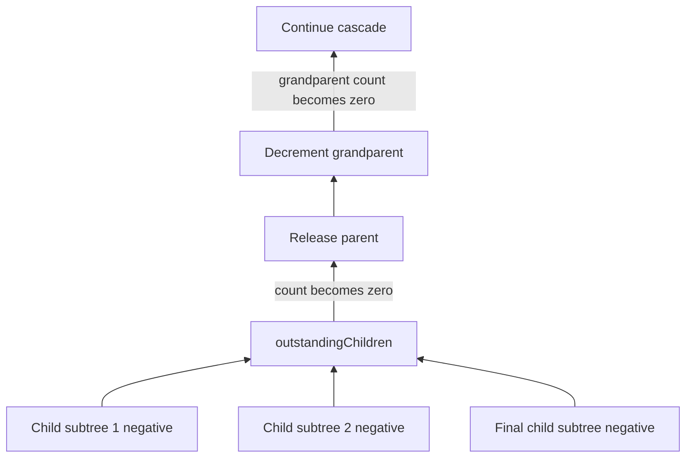

# Bounded asynchronous depth-priority worker

## Purpose

The original worker performed strict DFS: submit one parent's candidates, wait
for every result, then choose one surviving child. This minimized memory, but
created a dependency bubble between nearly every CUDA launch. The three-stage
dispatcher could overlap preparation, CUDA, and postprocessing only when other
workers happened to submit at the same time.

The new worker keeps a bounded number of evaluated branches active. It remains
exhaustive: limits pause submission but never classify a state as dead. A node
is released only after its expansion has completed and every child subtree has
completed negatively.

## Scheduler state

Each worker owns:

- one FIFO ready queue per depth;
- a count of jobs submitted but not returned;
- a count of all resident nodes it owns;
- high/low in-flight thresholds;
- a hard resident-node budget; and
- completion counters stored on every expanded parent.

"Ready" means CUDA has evaluated the state, it is alive, it is below depth 7,
and it has not yet been expanded. Ready is not a thread and not an additional
copy of the state: it is a `JobNode*` in a depth-indexed deque.



## Scheduling loop

The worker drains available results before and during submission. When allowed
to submit, it always selects the deepest non-empty ready queue. Submission
pauses at the high-water mark and resumes only below the low-water mark. The
default selected by the synthetic benchmark is 1,000/750 jobs per worker.

```text
while seed is incomplete:
    drain all immediately available results
    update high/low hysteresis

    while submission is enabled:
        parent = deepest ready state
        verify in-flight and resident admission
        submit every candidate child of parent
        opportunistically drain returned results

    if work remains in flight:
        block for one result chain
```



## Exhaustive completion invariant

Every node records `outstandingChildren` and `expansionComplete`.

1. Allocating a child increments its parent's outstanding count.
2. A returned live child is queued, not completed.
3. A tested negative/terminal child completes immediately.
4. An expanded parent completes only when its outstanding count becomes zero.
5. Completion then decrements its own parent's count and may cascade.



No queue limit, memory limit, timeout, or scheduling decision enters this
negative-completion path. Early global cancellation abandons results only
because the entire search is ending; abandoned nodes remain arena-resident and
are not reported as tested or pruned.

## Memory bound and escape reserve

`maxResidentNodes` counts active seed roots, retained ancestors, ready nodes,
and in-flight nodes. An allocator refill cache can hold up to
`FLUSH_THRESHOLD - 1` additional unused nodes per worker, so the shared pool
must include that overhead.

Before expanding a parent with `B` candidates at child depth `d`, admission
requires:

```text
resident + B + escapeBranching * (MAX_DEPTH - d) <= maxResidentNodes
```

The last term reserves enough room to drive one newly produced deepest branch
to terminal depth. It prevents a bounded scheduler from filling memory with
ready nodes and then lacking the capacity needed to prove any of them dead.

The default budget is 5,000 resident nodes per worker. In the benchmark, the
selected 1,000/750 configuration peaked around 1,075--1,083 nodes per worker,
leaving substantial safety margin. The higher budget accommodates variations
in pruning and branching without allocating an unbounded frontier.

## Dispatcher interaction and cancellation

The worker remains the sole producer/consumer for its SPSC inboxes. Multiple
active branches do not add threads. Blocking result collection uses a condition
variable; opportunistic collection remains non-blocking.

On a global solution or benchmark timeout, a worker marks its dispatcher
producer as abandoned. Postprocessing then stops pushing results to that inbox,
allowing both bounded pipeline queues to drain. Untested nodes are retained,
not released. A cancellation-aware blocking collect prevents a worker from
waiting forever after the global stop condition.

This behavior was added after a repeated benchmark exposed a timing-dependent
shutdown deadlock with nine of ten workers stopped and one still waiting.

## Correctness and stress evidence

`test_worker_async` provides two exhaustive reference cases:

| Case | Shape | Assertions |
|---|---:|---|
| Ordering | `4 + 4^2 + 4^3 = 84` jobs | Exact unique job set, no duplicates, depth-7 submission before all depth-5 parents expand, high-water respected, zero leaks |
| Tight memory | `20 + 20^2 + 20^3 = 8,420` jobs | Exact unique job set under a 220-node resident budget, no duplicates/loss, in-flight and resident limits respected, completion reaches seed root, zero leaks |

The existing planted-solution end-to-end test verifies that asynchronous search
still reconstructs the expected solution. Remote end-to-end tests verify the
same worker behind seed transport. Repeated timeout runs exercise cancellation
and bounded dispatcher shutdown.

## Performance experiment

Assumptions: ten workers, branching 150, synthetic survival 0.06, depth 7,
1,000-job CUDA capacity, 500 microseconds per mock kernel call, three fixed
seeds, five seconds per run. The benchmark command is reproducible with:

```sh
cd sketch
bash sim/benchmark_scheduler.sh
```

| High/low | Resident budget | Mean jobs/s | Relative to one expansion | Typical peak resident/worker |
|---:|---:|---:|---:|---:|
| 150/1 | 2,000 | 669,192 | 1.00x | ~183 |
| 500/375 | 4,000 | 1,348,374 | 2.01x | ~552 |
| **1,000/750** | **5,000** | **1,379,255** | **2.06x** | **~1,080** |
| 2,000/1,500 | 8,000 | 1,363,168 | 2.04x | ~2,135 |
| 4,000/3,000 | 12,000 | 1,276,439 | 1.91x | ~4,150 |

A narrower hysteresis sweep around 1,000 showed 750 as the best tested resume
point; 900 caused excessive mode switching and averaged materially lower.

The selected point is Pareto-preferable among tested configurations: it has the
highest measured mean, uses roughly half the active memory of 2,000 and one
quarter of 4,000, and stays far below its resident budget.

## What is and is not proven

Proven by construction/tests for the synthetic model:

- limits never prune;
- every submitted job is classified exactly once in exhaustive runs;
- parent release requires complete negative descendants;
- in-flight and resident peaks respect configuration;
- result batching may reorder completion without losing ownership;
- normal exhaustion drains the pool to zero; and
- early cancellation drains the dispatcher without pretending retained work
  was tested.

Not proven until the real board/kernel/levels are available:

- that 1,000/750 is optimal for the real state distribution;
- the real CUDA service time and transfer overlap;
- real branching/survival correlation by depth; and
- time-to-first-solution on representative levels.

The configuration is intentionally runtime-tunable. The same benchmark should
be rerun against real levels before freezing production defaults.
