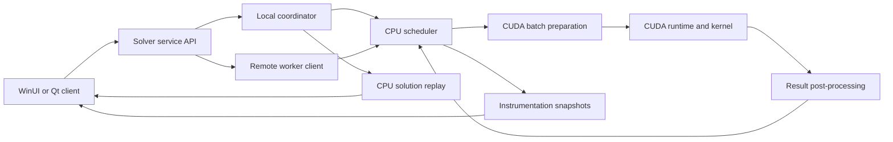
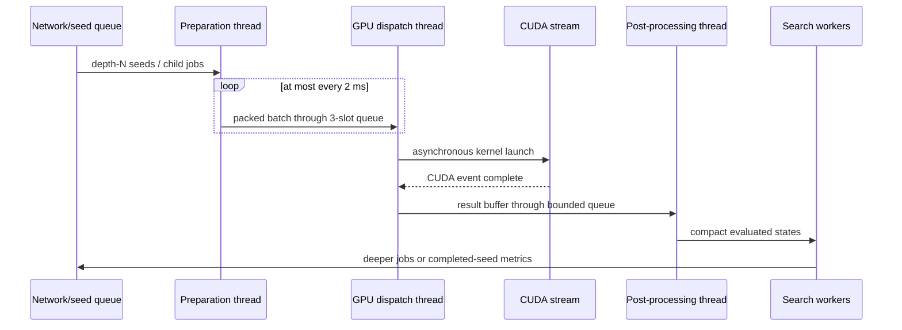

# Windows CUDA worker/client plan

## Objective

Build a native 64-bit Windows application that can solve locally with an
NVIDIA GPU, act as a remote worker for a Linux coordinator, inspect progress,
and replay solutions. The solver protocol and canonical 23-byte board state
remain platform-neutral; only the UI, socket/event integration, and CUDA build
packaging differ.

## Recommended stack

- Windows 11 x64, with Windows 10 supported where the selected CUDA toolkit is
  supported by NVIDIA.
- Visual Studio 2022, CMake, MSVC, and the matching NVIDIA CUDA toolkit.
- C++17 core library shared with Linux.
- WinUI 3 for a new native UI, or Qt 6 if one cross-platform desktop UI is more
  valuable than a Windows-native look. Keep the solver independent of either.
- Winsock 2 behind the same framed-transport interface used by POSIX sockets.
- CTest for CPU/protocol tests and a separately labelled CUDA test group.

Do not select a CUDA toolkit or minimum driver version until implementation
time: NVIDIA's supported Visual Studio, Windows, toolkit, and driver matrix is
time-sensitive and must be checked then.

## Component boundaries



The UI never owns node-pool pointers or calls CUDA directly. It sends commands
to a solver service and receives immutable progress snapshots and solutions.
This allows the engine to run headless as a Windows service or console worker
using the same binaries and tests.

## Repository/build restructuring

1. Move board rules and the reference solver into `liblaby_core`.
2. Move queues, workers, dispatcher, transport, and instrumentation into
   `liblaby_engine`.
3. Put CUDA-only translation units in `liblaby_cuda`; expose a narrow C++ API
   such as `evaluateBatch(InputBatch, OutputBatch, cudaStream_t)`.
4. Keep platform code in `platform/posix` and `platform/windows`.
5. Provide CMake presets for Linux GCC/Clang, Windows MSVC CPU-only, and Windows
   MSVC+CUDA builds.
6. Keep the present Makefile temporarily as a developer convenience, but make
   CMake/CTest the release and CI authority.

## Portable transport

The present prototype transfers build-dependent structures. Replace that
before heterogeneous deployment with a versioned wire format:

```text
magic | protocol version | message type | request id | payload length | payload
```

Encode integers explicitly in network byte order. Serialize the canonical
board's 23 defined bytes field-by-field, followed by depth and move-prefix
records. Never serialize pointers, padding, `bool`, C++ enums, or raw structs.

At connection time exchange:

- protocol versions and feature bits;
- CUDA availability, compute capability, VRAM, and preferred batch size;
- CPU worker count and resident-node capacity;
- canonical-state and kernel-result schema versions;
- optional TLS/authentication capability.

Use Schannel on Windows and OpenSSL or another reviewed TLS provider on Linux,
or place workers behind a mutually authenticated VPN. The current unauthenticated
TCP prototype must not be exposed to the public internet.

## Windows execution model

Use `std::jthread`/condition variables for the three dispatcher stages. Winsock
can initially use blocking sockets on dedicated network threads; IOCP is only
needed if profiling shows that many simultaneous coordinators matter. CUDA
completion should use events rather than blocking the preparation thread.



The GPU layer should use pinned host buffers, a small reusable buffer pool, and
at least two CUDA streams so host packing can overlap kernel execution and
device-to-host transfer. Queue bounds remain configuration limits derived from
VRAM and resident CPU memory.

## UI scope

The first useful client needs:

- local versus remote-worker mode;
- coordinator host, port, authentication, and reconnect controls;
- level selection and exact/beam search selection;
- GPU/driver detection with a CPU-reference fallback;
- jobs/s, batches/s, queue occupancy, GPU utilisation, resident nodes, and
  estimated tree size;
- worker/seed status and cancellation;
- solution depth, whether minimum depth is proven, and animated replay;
- exportable diagnostic and benchmark report.

All configuration should also be available through a headless CLI so automated
workers do not require an interactive desktop session.

## CUDA data path

Keep `CompactBoardState` as CPU storage. The preparation stage expands a batch
into a structure-of-arrays device format, which avoids unaligned nibble and
six-bit extraction across GPU threads. Kernel output should contain only what
post-processing cannot cheaply derive, preferably next-goal progress, validity,
and a compact resulting state or shift delta.

The CPU reference remains authoritative. For randomly generated and corpus-
derived states, compare CPU and CUDA results byte-for-byte. Test player/goal
ejection, player on spare, every insertion, all tile masks, multiple consecutive
ordered goals, and terminal states.

## Packaging and deployment

- Produce a signed MSIX or installer for the UI and a ZIP/MSI headless-worker
  package.
- Detect missing/incompatible NVIDIA drivers with an actionable message; do
  not bundle the display driver.
- Ship the required MSVC runtime and only redistributable CUDA runtime pieces
  permitted by the selected toolkit's licence.
- Store secrets in Windows Credential Manager, never plaintext configuration.
- Add crash dumps and rotating logs with tokens and board payloads redacted.
- Support graceful upgrade: drain current seeds, report metrics, then restart.

## Verification gates

1. MSVC CPU build passes every core, corpus, scheduler, and transport test.
2. Windows and Linux serialize identical golden wire messages.
3. Cross-platform coordinator/worker matrix passes in both directions.
4. CUDA output matches CPU output over deterministic random states and all
   shallow-level search states.
5. All depth-2/3/4 corpus solutions replay identically on Windows and Linux.
6. Cancellation, disconnect, coordinator restart, GPU failure, and malformed
   frames leave no blocked threads or leaked node/buffer capacity.
7. Soak tests run for at least an hour under Application Verifier and CUDA
   Compute Sanitizer where applicable.
8. Performance reports include throughput, latency percentiles, GPU occupancy,
   memory peaks, and CPU packing/post-processing cost.

## Delivery order

1. CMake and portable core library.
2. MSVC CPU-only console solver and tests.
3. Explicit portable wire protocol and Linux/Windows interoperability tests.
4. Windows CUDA adapter and CPU/CUDA equivalence suite.
5. Headless remote worker with reconnect and authentication.
6. UI, replay visualisation, and instrumentation dashboard.
7. Installer, signing, CI artifacts, soak testing, and release documentation.
